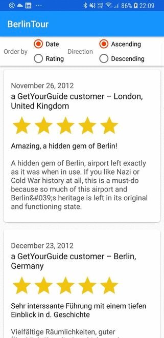

# BerlinTour
An app that shows the reviews of the [tour - Berlin Tempelhof Airport: The Legend of Tempelhof](https://www.getyourguide.com/berlin-l17/tempelhof-2-hour-airport-history-tour-berlin-airlift-more-t23776/)

### Getting started
Clone the repository and import the project in Android Studio, you can try the app installing the `app-release.apk` available in the project root.

### Dependencies
The dependencies for the project are described in the Gradle script `build.gradle` of the app, just sync the project in Android Studio and you are ready to go :)

List of third party libraries used in the project
- [Retrofit/OKhttp](http://square.github.io/retrofit/) - A type-safe REST client for Android and Java
- [Gson](https://github.com/google/gson) - Gson is a Java library that can be used to convert Java Objects into their JSON representation.

### Running it
You can [build and run](https://developer.android.com/tools/building/building-studio.html) the project using the Android Studio/Gradle. You need an [android emulator](http://developer.android.com/tools/devices/emulator.html) or a [real device](http://developer.android.com/tools/device.html) to test the build.

### Screenshots
